# Orange期权 知识体系

> 提炼自 Orange期权知识星球全量归档
> 时间跨度：2025-06-23 ~ 2026-09-04 | 1,859条主题 | 4,544条评论 | 1,525张图片 | 84份PDF

---

## 总论：以波动率为核心的商品期权交易体系

Orange期权的知识体系可概括为一句话：**以波动率状态为第一决策变量，叠加多维度信号验证，通过结构化策略组合实现风险可控的收益**。

整个体系由五层构成，每一层均遵循"理论→方法→结果"的闭环逻辑：

```
┌───────────────────────────────────────────────────┐
│  第五层：交易日与复盘层 — 案例 · 工作流 · 复盘闭环    │
├───────────────────────────────────────────────────┤
│  第四层：仓位与风控层 — 量化仓位 · Greeks管理 · 风控   │
├───────────────────────────────────────────────────┤
│  第三层：策略与执行层 — 决策树 · 买方族 · 卖方族 · 套利 │
├───────────────────────────────────────────────────┤
│  第二层：分析与信号层 — 波动率工具 · 基本面 · 五层验证   │
├───────────────────────────────────────────────────┤
│  第一层：哲学基础层 — 波动率优先 · Orange双击 · 均值回归  │
└───────────────────────────────────────────────────┘
```

以下逐层展开，每个核心模块均按 **理论（为什么）→ 方法（怎么做）→ 结果（得到什么）** 组织。

---

# 第一篇：哲学基础

## 1.1 波动率优先（Vol-First）

### 理论

传统交易以"涨跌方向"为第一决策变量，Orange体系则将**波动率状态**置于方向判断之前。原因有三：

1. **方向难判，波动率可量化**：价格方向受无数因素影响，但波动率有明确的统计分布和均值回归特性，可以被客观度量
2. **波动率是策略的前提条件**：同样的方向判断，在买方市场和卖方市场下需要完全不同的策略，选错策略类型比选错方向更致命
3. **波动率蕴含方向信息**：偏度（Skew）的变化、认购/认沽IV的分化，本身就是市场参与者对方向预期的聚合表达

### 方法

**四步波动率诊断法**：

| 步骤 | 问题 | 工具 | 判断标准 |
|------|------|------|---------|
| 1 | 当前隐波处于什么水平？ | IV百分位 | <30%便宜，>70%贵 |
| 2 | 隐波与实波的价差多大？ | IV/RV比 | >2倍时买方性价比低 |
| 3 | 期限结构是否合理？ | 近月-远月IV差 | 异常时存在套利 |
| 4 | 偏度是否出现异常？ | 认购-认沽隐波差 | 反映方向偏好突变 |

**决策链条**：

```
波动率诊断 → 买方市场 or 卖方市场？ → 策略类型选择 → 叠加方向判断 → 席位验证 → 入场/观望
```

### 结果

- **正确应用**：在低波环境下用买方策略，即使方向判断略有偏差，Vega扩张也能提供安全垫
- **错误应用**：在高波环境下用买方策略，即使方向看对，Vega压缩也会吞噬方向收益
- **核心结论**：方向判断是次要的，波动率环境判断才是首要的。"看对了方向但用错了策略"是最常见的亏损原因

## 1.2 Orange双击（Vega + Gamma）

### 理论

期权价格由多个Greek共同驱动，其中最重要的两个收益来源是：

| 收益来源 | Greek | 驱动因素 | 本质 |
|---------|-------|---------|------|
| 波动率扩张收益 | Vega | 隐波从低位向高位运动 | 市场对不确定性重新定价 |
| 方向性运动收益 | Gamma | 标的价格大幅单向运动 | 标的突破关键位后的加速 |

当两者同时发生时（"价波齐涨"），产生**非线性叠加效应**：价格运动加速→市场恐慌/贪婪→隐波进一步上升→Vega和Gamma同时贡献正收益。这是Orange体系追求的理想交易状态。

### 方法

**识别双击机会的三步法**：

1. **确认低波起点**：IV百分位<30%，确保Vega有扩张空间
2. **等待方向触发**：价格突破关键支撑/阻力位，Gamma开始加速
3. **验证价波同步**：价格运动方向与隐波运动方向一致（同涨或同跌）

**双买策略是实现双击的主要手段**：买入平值认购+平值认沽，同时获得Vega和Gamma的正向暴露。

### 结果

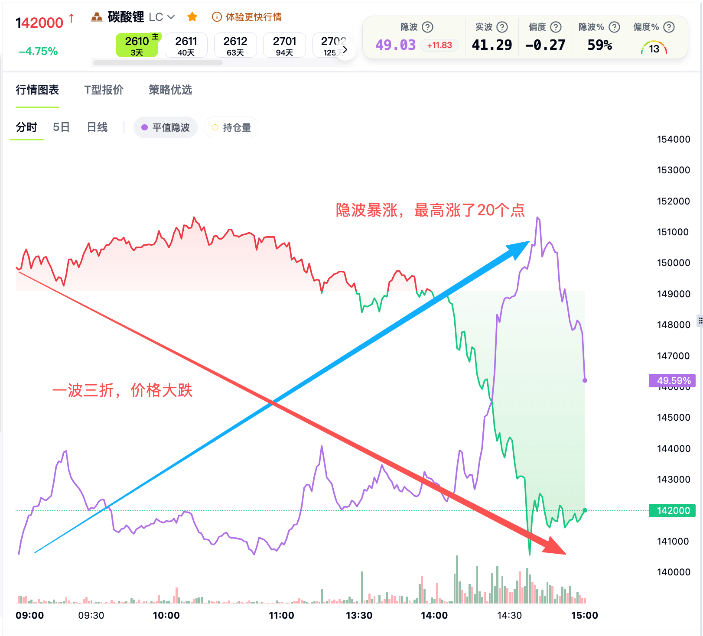
*实战案例：碳酸锂末日轮双买，隐波暴涨20点（Vega收益）叠加价格大跌（Gamma收益），双买策略实现双击。*

- **双击兑现**：Vega和Gamma同时贡献正收益，单笔交易收益可达数倍于单Greek收益
- **未兑现的情况**：价格运动但隐波不配合（如价涨波降），只有Gamma收益，Vega为负，总收益打折
- **核心结论**：双击是"可遇不可求"的最优结果，不应强求；但通过正确的波动率环境判断，可以提高双击出现的概率

## 1.3 均值回归与收敛交易

### 理论

金融市场的价格/波动率具有**均值回归**的统计特性：偏离越大，回归的概率越高、力量越强。Orange体系将这一统计规律转化为交易逻辑：

- 波动率会围绕某个中枢波动，极端偏离后倾向回归
- 相关品种/合约之间的价差也会回归合理水平
- "背离→收敛"是可重复、可量化的交易模式

### 方法

**三类收敛交易的操作框架**：

| 类型 | 背离识别方法 | 交易方式 | 收敛预期依据 |
|------|------------|---------|------------|
| 波动率背离 | 跨品种/跨月份IV差异扩大至历史极值 | 做多低估IV + 做空高估IV | 同板块品种IV应趋同 |
| 根号T偏离 | 期权定价偏离√T理论值 | 买入低估合约 + 卖出高估合约 | 数学定价关系必然修复 |
| 基差收敛 | 期现价差偏离至历史极值 | 买入低估一方 + 卖出高估一方 | 到期日期现必须收敛 |

**执行要点**：
1. 确认背离是"异常"而非"新常态"（检查基本面是否发生结构性变化）
2. 确认背离幅度达到历史极值（通常>2个标准差）
3. 设置止损：如果背离继续扩大，说明可能是结构性变化

### 结果

- **成功场景**：背离收敛，价差修复，策略获利。胜率较高（统计规律支撑），但单次收益有限
- **失败场景**：背离继续扩大（结构性变化），止损出场。亏损有限但频率需控制
- **核心结论**：收敛交易是"高胜率低赔率"的模式，需要严格的风控和耐心。Orange体系中大量策略（日历价差、跨品种套利、合成套利）均基于此逻辑

---

# 第二篇：分析与信号体系

> 本篇将波动率分析工具、基本面框架与五层信号验证体系统合为一个完整的"分析→判断→验证"流程。

## 2.1 波动率状态判断

### 理论

波动率是期权定价的核心变量，其状态直接决定了策略的性价比。波动率状态可分为"买方市场"和"卖方市场"两种：

- **买方市场**：隐波便宜，买期权"划算"，时间价值站在买方一边
- **卖方市场**：隐波贵，卖期权"划算"，时间价值站在卖方一边

判断的核心在于：隐波的绝对水平、相对位置、以及与实波的偏差。

### 方法

**五维指标诊断体系**：

| 维度 | 指标 | 含义 | 买方市场标准 | 卖方市场标准 |
|------|------|------|------------|------------|
| 绝对水平 | IV值 | 当前隐含波动率 | 历史低位 | 历史高位 |
| 相对位置 | IV百分位 | 历史分位数 | <30% | >70% |
| 定价效率 | IV/RV比 | 隐波与实波比值 | ≈1或<1 | >2 |
| 方向偏好 | 认购-认沽隐波差 | Skew信号 | 中性 | 极端偏斜 |
| 时间结构 | 近月-远月隐波差 | 期限结构 | 正常 | 异常倒挂 |

**判断流程**：

```
Step 1: 查看IV百分位 → 确定大致方向（买方/卖方/中性）
Step 2: 对比IV与RV → 确认定价是否合理
Step 3: 观察Skew和期限结构 → 识别结构性异常
Step 4: 综合判断 → 输出"买方市场"/"卖方市场"/"中性"结论
```

### 结果

- **买方市场确认**：选择双买、看涨价差、看跌价差等买方策略。隐波低意味着期权便宜，即使方向判断有误，时间成本也较低
- **卖方市场确认**：选择双卖、备兑、比例购等卖方策略。隐波高意味着期权贵，卖方有安全垫
- **误判代价**：在买方市场做卖方→卖出即被突破，亏损无限；在卖方市场做买方→时间价值快速衰减，"双买做错亏两边"

## 2.2 波动率云图与曲线解读

### 理论

波动率曲面将全市场期权的IV以三维形式呈现（行权价×到期月×IV），是理解全市场波动率结构的唯一全景工具。波动率曲线是曲面的二维切面（IV vs 行权价），用于精确定位具体行权价的交易机会。

### 方法

**云图四步解读法**：

| 步骤 | 观察维度 | 具体操作 | 交易含义 |
|------|---------|---------|---------|
| 1 | 整体高度 | IV绝对水平是高是低？ | 判断买方/卖方市场 |
| 2 | 倾斜方向 | 看涨IV vs 看跌IV谁高？ | 判断市场方向偏好 |
| 3 | 陡峭程度 | 近月 vs 远月差异多大？ | 判断期限结构是否异常 |
| 4 | 异常凸起 | 特定行权价IV是否异常高？ | 识别资金异动/期权墙 |

**曲线形态分析**：

| 曲线变化 | 含义 | 操作指引 |
|---------|------|---------|
| 左侧（低行权价）上移 | 认沽IV上升，恐慌加剧 | 考虑买认沽或双买 |
| 右侧（高行权价）上移 | 认购IV上升，看涨热情 | 考虑买认购或牛市价差 |
| 整体平移上移 | IV全面上升，波动率扩张 | 买方策略有利 |
| 整体平移下移 | IV全面下降，波动率压缩 | 卖方策略有利 |
| 斜率变陡 | Skew扩大，方向偏好增强 | 偏度交易机会 |

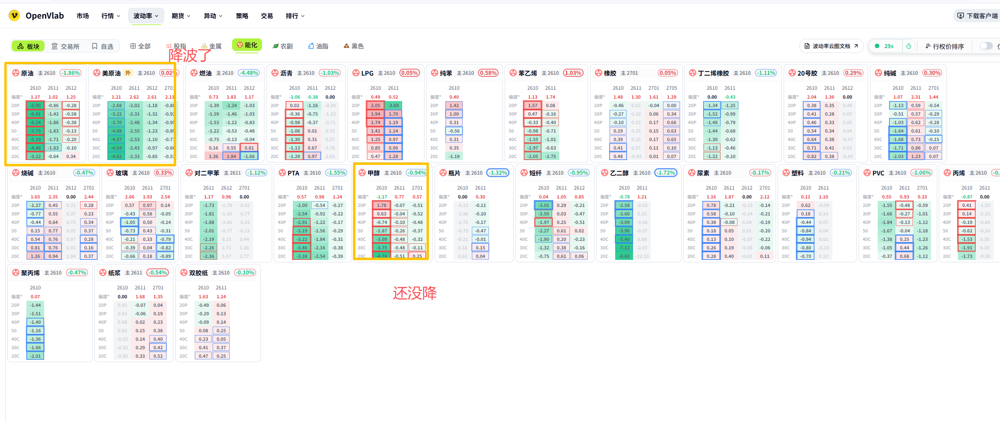
*能化板块波动率云图：展示各品种IV在行权价和到期月两个维度上的分布，可直观识别异常凸起和偏度结构。*

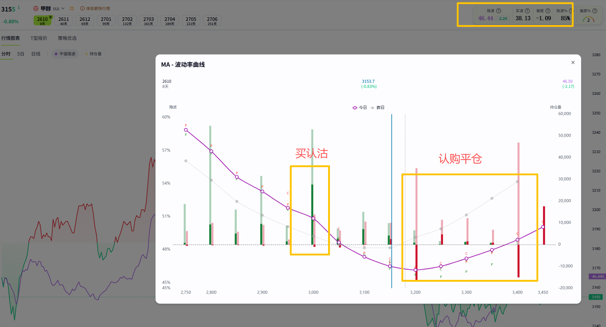
*甲醇波动率曲线实战：图中标注了"买认沽"区域和"认购平仓"区域，展示了如何根据曲线形态选择具体行权价。*

### 结果

- **识别买方机会**：云图整体偏低+局部有异常凸起 → 在异常凸起处可能存在资金异动，在低IV区域可布局买方策略
- **识别卖方机会**：云图整体偏高+Skew极端 → 卖出高IV一侧，关注期权墙作为天然支撑
- **典型信号**：
  - "标的上涨，隐波下降，看涨隐波下跌+看跌隐波上涨" → 上涨乏力，不宜追多
  - "近月偏度大幅飙升，远月不动" → 近期有事件驱动，可做日历价差

## 2.3 波动率背离体系

### 理论

波动率背离是Orange体系的**核心交易信号**。其理论基础是：同一板块/相关品种的波动率应当高度相关，当出现显著分化时，意味着市场定价出现了暂时性错误，存在收敛修复的套利机会。

背离的本质是**相对价值交易**：不做方向赌注，而是做多"被低估的波动率"、做空"被高估的波动率"。

### 方法

**五类背离的识别与操作**：

| 类型 | 识别方法 | 操作方式 | 收敛预期 |
|------|---------|---------|---------|
| **跨品种背离** | 同板块两品种IV差异>2个标准差 | 做多低估IV品种+做空高估IV品种 | 板块联动使IV趋同 |
| **跨月份背离** | 近月IV飙升但远月不动 | 日历价差（买远月卖近月） | 事件消退后近月IV回落 |
| **跨方向背离** | 看涨IV与看跌IV走势分化 | 偏度交易（Risk Reversal） | 方向预期修正后Skew回归 |
| **期现背离** | IV与RV差距>2倍 | 做空波动率（卖期权） | IV向RV收敛 |
| **根号T偏离** | 跨期定价偏离√T理论值 | 买入低估合约+卖出高估合约 | 数学关系修复 |

**执行检查清单**：

```
□ 背离是否达到历史极值？（>2σ）
□ 是否有基本面结构性变化？（排除"新常态"）
□ 流动性是否充足？（避免滑点吃掉利润）
□ 止损位设在哪里？（背离继续扩大的极端情况）
```

### 结果

- **成功场景**：背离收敛，价差修复。胜率较高（统计规律支撑），单次收益中等
- **失败场景**：基本面结构性变化导致背离持续扩大，止损出场
- **实战案例**：

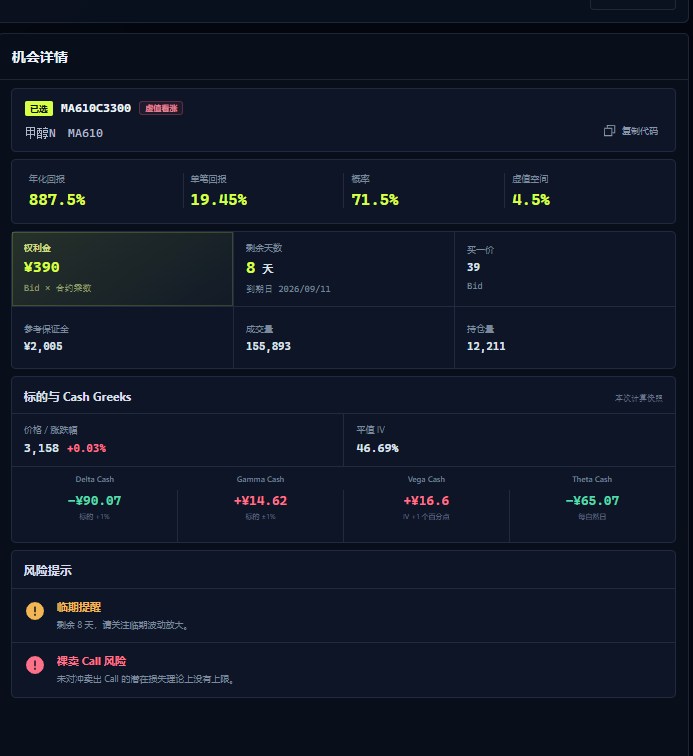
*甲醇MA610C3300认购机会：年化回报887.5%，Delta Cash -99.07。基于波动率背离/根号T偏离识别出的定价修复机会。*

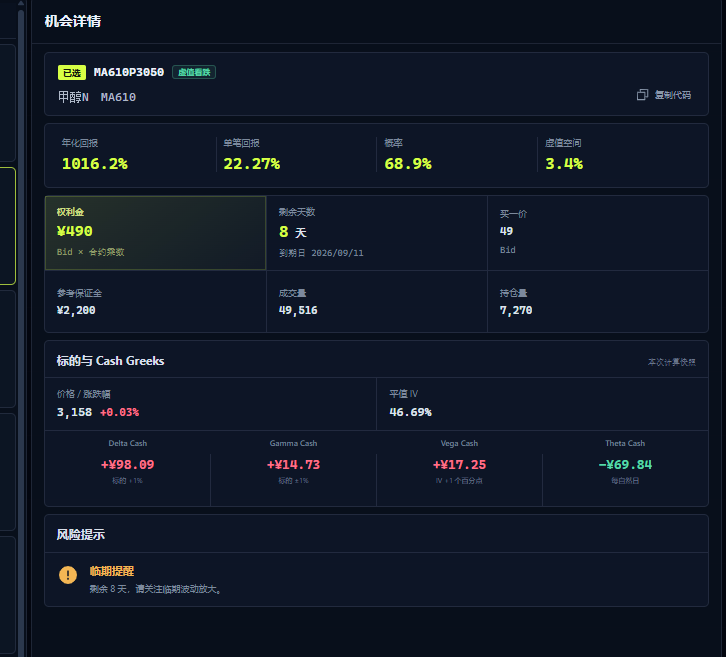
*甲醇MA610P3050认沽机会：年化回报1016.2%，Delta Cash +98.09。同一品种两个方向的机会同时呈现，体现了背离体系的双向应用。*

## 2.4 价格+隐波叠加分析

### 理论

价格与隐波的关系蕴含了市场状态的关键信息。单独看价格或单独看隐波都不够，两者的**组合关系**才能揭示真实的供需力量。

### 方法

**价波关系四象限判断法**：

| 象限 | 价格 | 隐波 | 市场状态 | 策略倾向 |
|------|------|------|---------|---------|
| 价波齐涨 | ↑ | ↑ | 最强信号，Vega+Gamma双击 | 双买/买认购 |
| 价涨波降 | ↑ | ↓ | 上涨乏力，隐波不支持 | 谨慎追多，考虑减仓 |
| 价跌波涨 | ↓ | ↑ | 下跌确认，恐慌升温 | 双买/买认沽 |
| 价波齐跌 | ↓ | ↓ | 卖方市场，波动率压缩 | 双卖 |

**操作要点**：
1. 每日在价格图上叠加隐波曲线，观察两者关系
2. 关注关系"切换"的时刻（如从"价涨波降"切换为"价波齐涨"）
3. 结合期限结构判断切换的可持续性

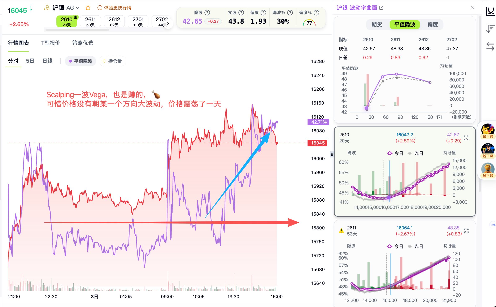
*沪银实战：价格走势图上方叠加隐波曲线，标注"Scalping一波Vega"，展示了日内波动率交易的进出场时机。*

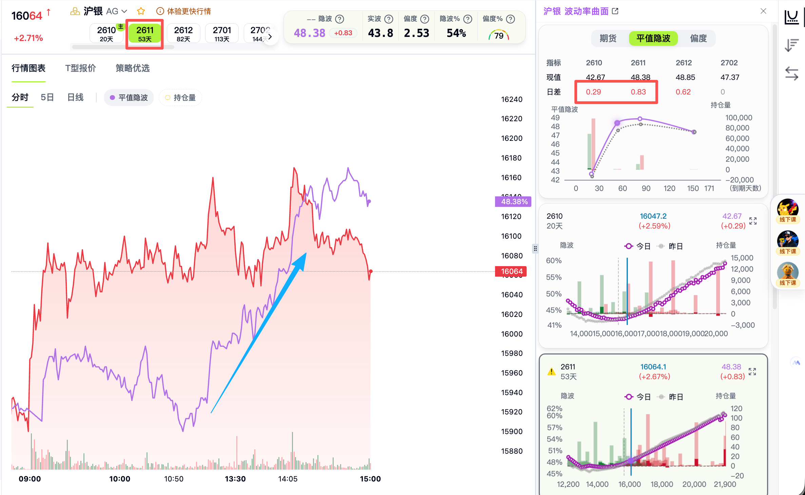
*沪银期限结构分析：对比2610和2611两个合约的IV日差（0.29 vs 0.83），识别近远月定价差异。*

### 结果

- **正确识别"价波齐涨"**：双买策略获得Vega+Gamma双击，收益最大化
- **正确识别"价涨波降"**：避免追多被套，或及时止盈
- **错误信号**：偶尔出现"假信号"（如短暂价波齐涨后迅速回落），需要结合其他信号层验证

## 2.5 商品基本面分析框架

### 理论

商品期权的标的资产是实物商品，其价格受供需基本面驱动。基本面分析的目的不是预测价格方向，而是回答两个问题：

1. **估值是否极端？** — 当前价格在历史中处于什么位置？
2. **是否有催化剂？** — 什么因素可能打破当前均衡？

只有"估值极端+催化剂存在"时，基本面才支持高胜率的期权交易。

### 方法

**三要素诊断模型**：

```
商品基本面 = f(库存, 基差, 利润)
```

| 要素 | 分析内容 | 数据来源 | 极端信号 |
|------|---------|---------|---------|
| 库存 | 绝对水平、消费比、变化趋势 | 交易所周报、行业数据 | 历史极值（>90%或<10%分位） |
| 基差 | 现货vs期货价差 | 现货报价、期货价格 | Back极端（现货极紧）或Contango极端（库存极多） |
| 利润 | 产业链利润分配 | 行业成本模型 | 利润为负（亏损减产）或暴利（增产压力） |

**期限结构分析**：

| 结构 | 含义 | 交易含义 |
|------|------|---------|
| Back结构（近期>远期） | 现货紧张 | 近月有支撑，正套有利 |
| Contango（远期>近期） | 供给充裕 | 近月压力大，反套有利 |

**估值+驱动双条件检查**：

```
□ 估值是否极端？（历史分位>90%或<10%）
□ 是否有催化剂？（政策变化、供需突变、天气异常等）
□ 两个条件同时满足 → 高胜率交易机会
□ 只有一个条件满足 → 降低仓位或观望
□ 两个都不满足 → 不交易
```

### 结果

- **估值极端+催化剂有**：高胜率交易。如库存历史低位+突发供给中断 → 做多波动率/买认购
- **估值极端+催化剂无**：可能是"价值陷阱"，价格可以在极端位置停留很久。不宜急于入场
- **估值正常+催化剂有**：交易催化剂本身。如政策发布前布局波动率策略
- **估值正常+催化剂无**：不交易。没有边际信息

## 2.6 五层信号金字塔

### 理论

单一信号容易产生假信号，多层信号交叉验证可以显著提高交易胜率。Orange体系将信号分为五层，形成一个金字塔结构：

- **底层（波动率）** 是地基 — 决定策略类型的大方向
- **中层（席位+基本面+技术面）** 是验证 — 确认底层信号的可靠性
- **顶层（事件风险）** 是天花板 — 任何情况下都不能忽视的"一票否决"

核心原则：**上层信号决定方向，下层信号决定时机。波动率信号是地基，事件风险是天花板。**

### 方法

**五层信号架构**：

```
           ┌──────────┐
           │ 第五层    │  事件风险 → 一票否决
           ├──────────┤
          ┌┴──────────┴┐
          │ 第四层      │  价格/技术 → 时机选择
          ├────────────┤
         ┌┴────────────┴┐
         │ 第三层        │  基本面 → 方向确认
         ├──────────────┤
        ┌┴──────────────┴┐
        │ 第二层          │  席位/资金 → 聪明钱验证
        ├────────────────┤
       ┌┴────────────────┴┐
       │ 第一层            │  波动率 → 策略类型决定
       └──────────────────┘
```

**各层信号详解**：

| 层级 | 信号内容 | 核心工具 | 输出 |
|------|---------|---------|------|
| 第一层：波动率 | IV水平、IV vs RV、期限结构、偏度、背离 | 见2.1-2.4节 | 买方市场/卖方市场 |
| 第二层：席位/资金 | 机构增减仓、散户情绪、跨月布局 | 持仓数据追踪 | 聪明钱验证 |
| 第三层：基本面 | 库存+基差+利润、估值+驱动 | 见2.5节 | 方向逻辑支撑 |
| 第四层：价格/技术 | 支撑阻力、期权墙突破、降波上涨/升波下跌 | 价波叠加图 | 入场时机 |
| 第五层：事件风险 | FOMC/非农/CPI、地缘、到期日、周末/长假 | 事件日历 | 一票否决 |

**席位信号四象限**：

| 信号组合 | 含义 | 操作建议 |
|---------|------|---------|
| 机构增仓 + 方向配合 | 聪明钱认可当前逻辑 | 入场 |
| 机构减仓 + 方向配合 | 机构止盈离场 | 跟随止盈 |
| 机构增仓 + 方向不配合 | 机构逆势建仓，可能有深层逻辑 | 观望，等待确认 |
| 散户大量涌入 | 反向情绪指标 | 警惕反转 |

**技术面四类信号**：

| 信号 | 识别方法 | 操作含义 |
|------|---------|---------|
| 降波上涨 | 价格上涨但隐波下降 | 上涨动能减弱，不宜追多 |
| 升波下跌 | 价格下跌且隐波上升 | 下跌得到确认，恐慌升温 |
| 期权墙突破 | 价格突破大量持仓集中的行权价 | 加速信号，可能单边行情 |
| 关键支撑/阻力 | 技术面关键位（前高前低、整数关口等） | 配合波动率判断突破有效性 |

**事件风险分类与应对**：

| 事件类型 | 可预测性 | 影响范围 | 应对策略 |
|---------|---------|---------|---------|
| FOMC/非农/CPI | 可预测（日历已知） | 全市场 | 提前减仓或离场 |
| 地缘政治 | 部分可预测（紧张升级时） | 特定品种 | 事件交易或规避 |
| 到期日效应 | 可预测（日历已知） | 近月合约 | 末日轮博弈或规避 |
| 周末/长假 | 可预测 | 全市场 | 周五/长假前减仓 |

**综合验证评分体系**：

```
做多信号确认度 = 波动率支持(40%) + 席位配合(20%) + 基本面支持(20%) + 技术面确认(10%) + 无事件风险(10%)

高确认度（≥80%）：五层全部支持 → 正常仓位入场
中确认度（50-80%）：三层支持 → 轻仓试探
低确认度（<50%）：信号矛盾 → 观望
```

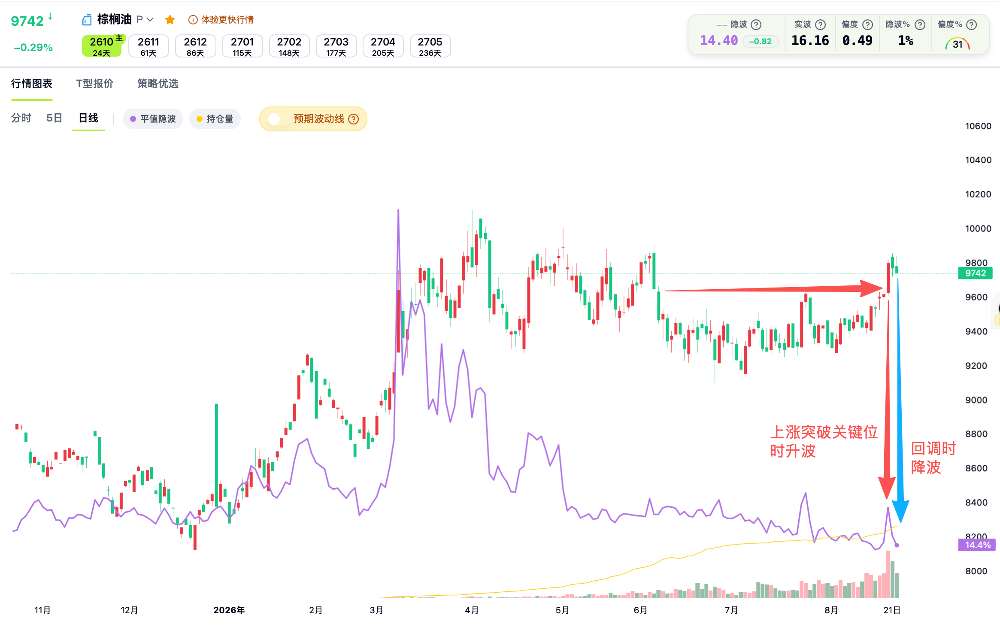
*棕榈油价格走势：标注了"上涨突破关键位时升波"和"回调时降波"的典型模式，验证了价波关系的理论。*

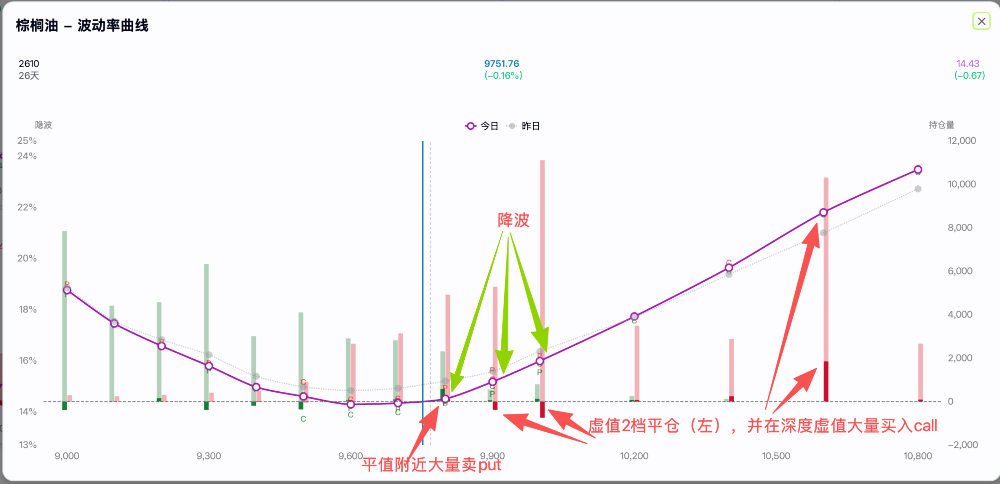
*棕榈油波动率曲线：展示了"降波"过程中的持仓结构，标注了认沽和认购方向的资金分布。*

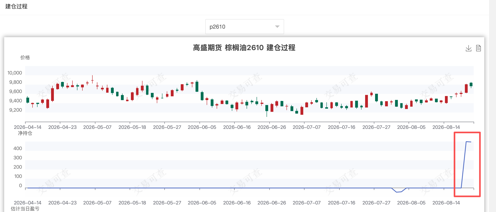
*机构建仓追踪：高盛在棕榈油2610合约上的持仓变化，展示了机构资金逐步建仓的过程。*

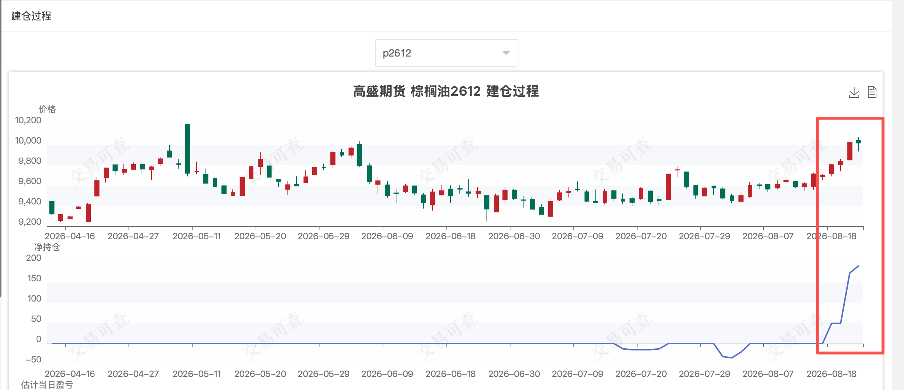
*跨月建仓布局：同一机构在2610/2611/2612/2701多个合约上的持仓分布，展示了机构的跨期策略意图。*

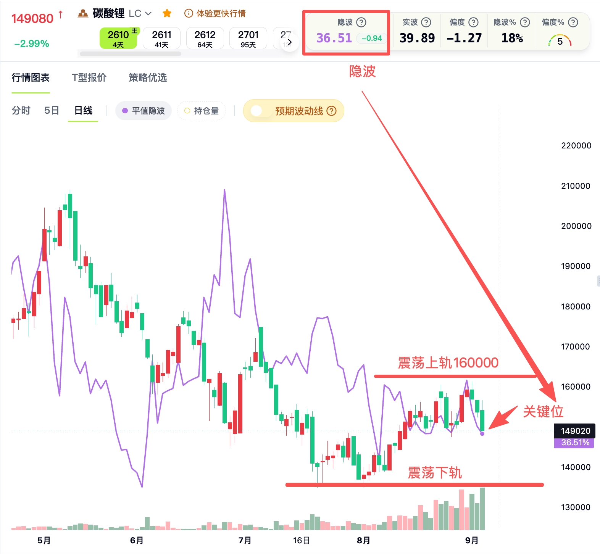
*碳酸锂日线图：价格曲线叠加隐波走势，标注了"震荡上轨""下轨""关键位"等技术面参考位。*

### 结果

- **高确认度入场**：胜率最高，可正常仓位。五层信号共振的情况不常见，但一旦出现，是最可靠的交易机会
- **中确认度试探**：有不确定性，轻仓博弈。如果市场验证了判断，再加仓
- **低确认度观望**：信号矛盾时最好的策略就是不交易。"不交易也是一种交易"
- **席位配合**：增强了波动率信号的可信度，可以更有信心地入场
- **机构止盈信号**：当机构开始减仓且方向仍然配合时，应跟随止盈而非贪心持有
- **技术面确认突破**：配合波动率和基本面支持，可以积极入场
- **期权墙突破**：往往是加速行情的起点，是重要的入场/加仓信号
- **正确规避事件风险**：虽然可能错过事件后的有利波动，但保护了本金。"活着才能继续交易"

---

# 第三篇：策略与执行体系

> 本篇以决策树为统领，按买方策略族、卖方策略族、套利策略族分组，每个策略均包含完整的入场→管理→出场规则。

## 3.1 策略选择决策树

### 理论

策略选择不是随意的，而是遵循严格的逻辑链条：**波动率环境→策略类型→方向调整→信号验证→仓位确定**。决策树是整个策略体系的"入口"，所有交易必须从决策树开始。

### 方法

```
第一步：判断波动率环境（见2.1节）
│
├── 买方市场（IV百分位<30%）
│   ├── 有方向观点 → 看涨价差 / 看跌价差（3.3节）
│   └── 无方向观点 → 双买（3.2节）
│
├── 卖方市场（IV百分位>70%）
│   ├── 有方向观点 → 备兑（3.3节）/ 比例购（3.3节）
│   └── 无方向观点 → 双卖 / 宽跨式（3.3节）
│
└── 中性环境
    ├── 近月偏度异常 → 日历价差（3.4节）
    ├── 跨品种IV背离 → 跨品种套利（3.4节）
    ├── 根号T偏离 → 定价修复策略（3.4节）
    └── 到期日临近 → 末日轮博弈（3.2节）

第二步：席位/资金验证（见2.6节）
├── 资金配合 → 进入第三步
└── 资金不配合 → 观望或轻仓

第三步：事件风险排查（见2.6节）
├── 有重大事件 → 减仓/离场规避
└── 无重大事件 → 正常持仓

第四步：确定仓位（见第四篇4.1节）
├── 高确认度 → 标准仓位
├── 中确认度 → 轻仓试探
└── 低确认度 → 不交易
```

### 结果

- **严格执行决策树**：避免了"在错误的环境下用错误的策略"这一最常见的亏损原因
- **跳过决策树直接交易**：往往是在"赌博"而非"交易"，长期必然亏损

## 3.2 买方策略族

### 理论

买方策略在**低波环境**（IV百分位<30%）下使用，核心逻辑是做多波动率扩张。买方策略的共同特征是：正Vega+正Gamma+负Theta。时间价值衰减（Theta）是买方的确定成本，因此**入场时机和出场纪律**比方向判断更重要。

### 方法

#### 3.2.1 双买（Long Straddle）

| 要素 | 内容 |
|------|------|
| 结构 | 买入平值认购 + 买入平值认沽 |
| 入场条件 | IV百分位<30%，IV/RV≈1或<1，无即将到来的重大事件 |
| 行权价选择 | 平值或接近平值（Delta绝对值≈0.5） |
| 止盈 | IV百分位升至50%以上，或获得满意的Gamma收益 |
| 止损 | 权利金损失超过50%，或论点被打破 |
| 仓位 | 总资金的5%（见4.1节） |

**最佳场景**（价波齐涨/齐跌）：Vega+Gamma双击，收益可达权利金的2-5倍
**最差场景**（价格不动+IV下降）：Theta+Vega双杀，损失全部权利金

#### 3.2.2 末日轮（End-of-Life Gamma）

| 要素 | 内容 |
|------|------|
| 结构 | 买入即将到期的廉价期权 |
| 入场条件 | 到期日当天或前一天，标的在关键位附近，权利金极低 |
| 止盈 | Gamma爆发兑现 → 立即止盈 |
| 止损 | 到期前未爆发 → 接受归零 |
| 仓位 | 总资金的1-2%，"用归0的心态对待" |

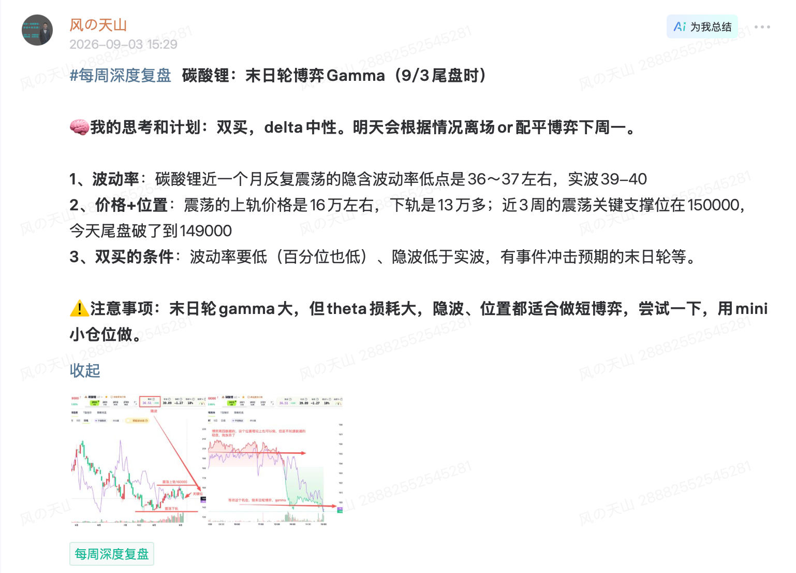
*碳酸锂末日轮实战：每周深度复盘中标注了末日轮双买机会，价格图上标注了入场点位和IV变化。*

**核心心态**：彩票心态。"不中奖是正常的，中奖了是惊喜"。胜率极低但赔率极高。

### 结果

- 买方策略的核心风险是Theta——时间价值衰减是确定的成本
- "双买做错亏两边"是买方最常见的失败模式：价格不动，两个方向的期权同时贬值
- 通过严格的入场条件（IV必须足够低）和仓位控制（5%/1-2%），确保单次亏损可控

## 3.3 卖方策略族

### 理论

卖方策略在**高波环境**（IV百分位>70%）下使用，核心逻辑是做空波动率压缩。卖方策略的共同特征是：负Vega+负Gamma+正Theta。时间价值是卖方的盟友，但**尾部风险**是卖方的致命威胁——"赚了很多次小钱，一次大亏全还回去"是卖方最常见的失败模式。

### 方法

#### 3.3.1 双卖/宽跨式（Short Strangle）

| 要素 | 内容 |
|------|------|
| 结构 | 卖出虚值认购 + 卖出虚值认沽 |
| 入场条件 | IV百分位>70%，IV/RV>2，事件已过或即将"泄波" |
| 行权价选择 | 虚值，优先选择"期权墙"外侧 |
| 止盈 | "隐波泄掉了"= 卖方获利了结信号 |
| 止损 | 价格突破行权价，或IV继续上升至极端水平 |
| 仓位 | 保证金占用不超过总资金的20% |

**关键规则**：必须选择足够虚的行权价，尾部风险巨大。能化板块做空波动率时"关注次月或远月，不要在最近月上操作"。

#### 3.3.2 备兑（Covered Call）

| 要素 | 内容 |
|------|------|
| 结构 | 持有标的期货 + 卖出虚值认购 |
| 入场条件 | 温和看涨，IV中高水平，预期不突破行权价 |
| 行权价选择 | 虚值，预期价格上界的1-2个标准差处 |
| 止盈 | 价格接近行权价时评估展期或平仓 |
| 本质 | 用截断上涨空间换取确定性的权利金收入 |

#### 3.3.3 比例购（Ratio Spread）

| 要素 | 内容 |
|------|------|
| 结构 | 卖出深虚值期权×2-3手 + 买入浅虚值期权×1手 |
| 入场条件 | 温和方向观点 + 做空波动率 |
| 比例规则 | 1:2（保守）、1:1（标准）、2:1（激进），详见4.1节 |
| 核心风险 | 尾部风险需严格管理 |

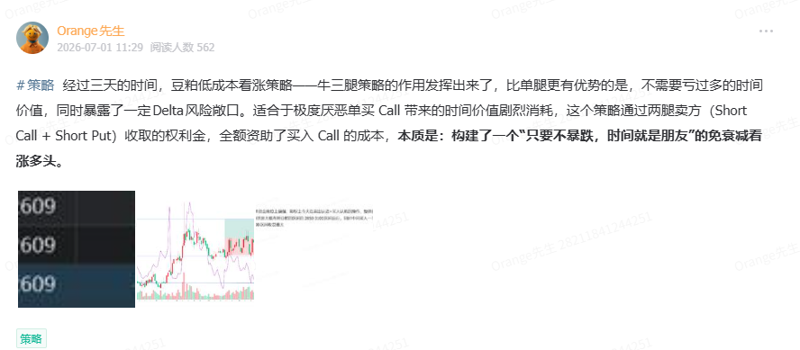
*豆粕多腿策略实战：展示了牛三腿策略的具体构建方式，适合温和看涨+波动率观点的组合。*

### 结果

- 卖方策略的最佳环境是"价波齐跌"：Vega压缩+Theta时间价值，收益最大化
- 核心风险是尾部事件——必须通过行权价选择（期权墙外侧）和仓位控制来防范
- 备兑策略是"空波动率+多方向"的组合，适合长期持有标的同时增强收益

## 3.4 套利与高级策略族

### 理论

套利策略基于**均值回归**的统计特性（见1.3节），不依赖方向判断，而是交易定价异常的修复。高级策略是针对特定市场环境的精细化组合，通常涉及多腿、多品种、多月份。

### 方法

#### 3.4.1 价差策略

| 策略 | 结构 | 适用场景 | 优势 | 风险 |
|------|------|---------|------|------|
| 看涨价差 | 买低行权价认购+卖高行权价认购 | 温和看涨 | 比裸买便宜，亏损有限 | 收益有上限 |
| 看跌价差 | 买高行权价认沽+卖低行权价认沽 | 温和看跌 | 比裸买便宜，亏损有限 | 收益有上限 |
| 日历价差 | 买远月+卖近月（同行权价） | 近月偏度异常 | 做空近月高偏度 | 远月IV也上升 |
| 铁鹰 | 四腿组合 | 震荡行情 | 风险完全限定 | 收益有限 |

#### 3.4.2 高级策略

| 策略 | 结构 | 适用场景 |
|------|------|---------|
| 海鸥（Seagull） | Risk Reversal + 期权组合 | 方向性交易，卖期权补贴买期权成本 |
| 合成套利 | 合成看跌期货+期货做多 | 无风险套利（定价偏差时） |
| Gamma Scalping | 到期日双买 | 博弈到期日Gamma爆发 |
| 跨品种套利 | 做空高IV品种+做多低IV品种 | 基于板块IV背离 |

**跨品种Vega对冲比例**（高级）：

| 品种对 | Vega对冲比例 | 逻辑 |
|--------|------------|------|
| 甲醇:苯乙烯 | 5:3 | 波动率弹性差异 |
| 原油:沥青 | 1:9 | 品种规模与波动率差异 |

### 结果

- 价差策略的共同特点：收益有限、风险有限、胜率高于裸买/裸卖
- 合成套利：理论上的无风险收益，但机会稀少且转瞬即逝
- 跨品种套利：基于波动率背离的相对价值交易，胜率较高但需严格止损

---

# 第四篇：仓位与风控体系

> 本篇是Orange体系中"活下去"的核心——再好的分析和策略，没有仓位管理和风控，一次极端事件就能前功尽弃。

## 4.1 仓位量化管理

### 理论

仓位管理的本质是**在不确定性和收益之间找到平衡**。Orange体系的仓位管理遵循三个原则：

1. **单笔亏损可控**：任何一笔交易的亏损都不应影响整体资金安全
2. **胜率×赔率 > 1**：只有期望值为正的交易才值得参与
3. **信号强度决定仓位**：确认度越高，仓位越大；信号模糊时轻仓或不交易

### 方法

#### 标准仓位配置规则

| 策略类型 | 标准仓位 | 说明 |
|---------|---------|------|
| 双买策略 | 总资金的5% | 如总资金200万，权利金上限10万 |
| 末日轮 | 总资金的1-2% | 彩票心态，接受归零 |
| 价差策略 | 总资金的2-3% | 风险有限，可适当提高 |
| 卖方策略 | 保证金≤总资金20% | 需考虑尾部风险 |
| 轻仓试探 | 标准仓位的1/3-1/2 | 中确认度时使用 |

#### Delta Cash中性原则

组合构建时追求**Delta Cash中性**，即组合整体的方向性暴露接近零：

- 买入认购的Delta Cash + 卖出认沽的Delta Cash ≈ 0
- 通过跨品种、跨方向的组合实现方向性对冲
- 不需要绝对为零，但应控制在合理范围内

#### 止损规则

| 止损类型 | 触发条件 | 操作 |
|---------|---------|------|
| 权利金止损 | 权利金损失超过50% | 无条件出场 |
| 点数止损 | 亏损超过150点 | 无条件出场 |
| 论点止损 | 核心论点被打破（如IV百分位突破阈值） | 果断出场 |

#### 关键纪律

```
□ 永远不要在亏损头寸上加仓摊平成本（"摊平成本是破产的快车道"）
□ 信号不充分时可以用mini仓试探（极小仓位验证判断）
□ 期望值计算：胜率 × 平均盈利 > 败率 × 平均亏损 → 才值得交易
□ 利润持仓：已有浮盈时，可以用浮盈持仓博弈更大收益，不追加风险资金
```

### 结果

- **严格执行仓位规则**：单笔亏损不影响整体，长期存活有保障
- **违反仓位规则**（重仓/摊平/不止损）：一次极端事件就可能导致巨额亏损或爆仓
- **核心结论**：仓位管理不是限制收益，而是确保"活得足够久去实现复利"

## 4.2 Greeks动态管理

### 理论

期权组合的风险暴露由四个Greek共同描述，它们随市场变化不断变动。静态构建组合只是起点，**动态管理Greeks**才是持续盈利的关键。Orange体系的Greeks管理遵循一个核心原则：**不要重新平衡正在盈利的一边**。

### 方法

#### Delta管理

| 规则 | 操作 | 说明 |
|------|------|------|
| Delta Cash中性 | 组合构建时追求方向性暴露接近零 | 不赌方向，靠波动率赚钱 |
| 再平衡阈值 | Delta偏离目标±0.3时再平衡 | 过于频繁的再平衡会侵蚀利润 |
| 盈利侧不 rebalance | 正在盈利的一侧不调整 | "让利润奔跑" |
| 趋势成熟减仓 | 随趋势发展逐步降低敞口，而非加码 | 趋势末期风险最大 |

#### Gamma Scalping

| 规则 | 操作 | 说明 |
|------|------|------|
| 合约选择 | 近月合约 | Gamma在到期日前最大 |
| 收益目标 | 10% | 达到即止盈 |
| 速度要求 | 执行速度至关重要 | Gamma窗口转瞬即逝 |
| 适用环境 | 价波齐涨/齐跌的双击场景 | 需要方向和波动率同步 |

#### Vega跨品种对冲

| 规则 | 操作 | 说明 |
|------|------|------|
| Vega配平 | 跨品种对冲使组合Vega接近中性 | 消除波动率方向性暴露 |
| 对冲比例 | 根据品种Vega比值计算 | 如甲醇:苯乙烯=5:3，原油:沥青=1:9 |
| 动态调整 | IV变化后重新计算比例 | 保持真正的Vega中性 |

#### Theta管理

| 规则 | 操作 | 说明 |
|------|------|------|
| 10-15天展期规则 | 持仓进入到期前10-15天时考虑展期 | Theta衰减在最后两周加速 |
| 展期方向 | 平仓近月 + 开仓次月 | 保持相同的策略结构 |
| 例外情况 | 有明确Gamma/Vega观点时可持有到期 | 如末日轮策略 |

### 结果

- **动态Greeks管理**：组合风险始终在可控范围内，不会因为市场变化而"被动挨打"
- **静态持仓不管**：Greeks随市场漂移，可能在不知不觉中积累了大量风险暴露
- **核心结论**：Greeks管理是"术"层面的核心能力，需要每日监控和调整

## 4.3 风险管理框架

### 理论

风险管理的本质是"活下去"。期权交易的非线性特征意味着：一次不受控的亏损可以抹去数十次成功的盈利。Orange体系的风控哲学：**先求不败，再求胜**。

### 方法

**四维风控体系**：

#### 维度一：结构性风控

| 方法 | 操作 | 目的 |
|------|------|------|
| 价差替代裸卖 | 用价差策略替代裸卖期权 | 限制最大亏损 |
| Delta管理 | 控制组合Delta敞口（见4.2节） | 控制方向性风险 |
| Vega对冲 | "Vega配平"（见4.2节） | 控制波动率风险 |

#### 维度二：仓位管理

| 原则 | 操作 | 适用场景 |
|------|------|---------|
| 轻仓博弈 | 小仓位试探 | 信号不明确时 |
| 利润持仓 | 只用浮盈持仓，不追加 | 已有盈利时 |
| 空仓过周末 | 周五/长假前减仓 | 规避隔夜风险 |
| 末日轮不重仓 | 彩票心态，接受归零 | 末日轮策略 |

#### 维度三：止盈止损

| 原则 | 触发条件 | 操作 |
|------|---------|------|
| 止盈离场 | 达到预设目标 | 全部平仓 |
| 减仓止盈 | 部分达到目标 | 分批锁定利润 |
| 错了就认 | 论点被打破 | 果断止损 |
| 落袋为安 | 浮盈可观 | 不贪心，锁定利润 |

#### 维度四：事件风控

| 原则 | 操作 |
|------|------|
| 规避周末风险 | 周五减仓或离场 |
| 黑天鹅防范 | 重大事件前降低敞口 |
| 别追高 | 不追涨，等待回调 |

**事件前检查清单**：

```
□ 未来48小时内是否有重大宏观数据发布？
□ 是否有地缘政治紧张升级？
□ 是否是到期日前一天？
□ 是否是长假前最后一个交易日？
→ 任一为"是" → 降低敞口或离场
```

### 结果

- **严格执行风控**：长期存活，复利增长。即使单笔交易亏损，总体可控
- **忽视风控**：一次极端事件可能导致爆仓或巨额亏损，前功尽弃
- **核心结论**："在期权市场，活得久比赚得多更重要"

---

# 第五篇：交易日与复盘体系

> 本篇将前四篇的理论和策略串联为一个完整的交易日闭环，并通过真实案例展示全流程。

## 5.1 完整交易日案例

### 理论

一个完整的交易决策包含六个环节：**晨间扫描→信号识别→策略构建→入场执行→持仓管理→出场复盘**。以下用四个真实案例展示Orange体系在不同市场环境下的完整决策流程。

### 方法

#### 案例一：棉花看涨比例价差 — 2天短周期

**晨间扫描**：
- 波动率诊断：棉花IV百分位25%（买方市场），IV/RV≈0.9
- 基本面：库存处于历史低位，下游需求回暖（估值极端+催化剂有）
- 席位信号：某机构连续3日增持认购

**信号识别**：
- 五层验证：波动率✓ + 基本面✓ + 席位✓ + 技术面（突破震荡上轨）✓ + 无事件风险✓
- 确认度：高（五层全部支持）

**策略构建**：
- 选择比例购（而非裸买）：温和看涨+做空波动率
- 结构：买入浅虚值认购×1 + 卖出深虚值认购×2
- 行权价：买入平值+1档，卖出平值+3档

**入场执行**：
- 仓位：总资金的3%
- Delta Cash：通过比例控制方向性暴露

**持仓管理**：
- Day 1：价格上涨1%，隐波上升2点 → 价波齐涨，持仓不动
- Day 2：价格继续上涨突破关键位 → Gamma加速

**出场复盘**：
- 止盈：Day 2收盘前平仓，收益约权利金的1.5倍
- 复盘：比例购结构在温和上涨中表现优异，卖出腿贡献了额外的Theta收益

#### 案例二：豆粕牛三腿 — 9天趋势交易

**晨间扫描**：
- 波动率诊断：豆粕IV百分位20%（深度买方市场）
- 基本面：南美产区干旱，大豆减产预期升温
- 席位信号：多头席位持续增仓

**策略构建**：
- 选择牛三腿（多腿看涨组合）：看好方向，同时控制成本
- 持仓周期预期：中长期（1-2周）

**持仓管理**：
- Day 1-3：价格缓慢上涨，隐波稳定 → 持仓不动
- Day 4-6：价格加速上涨，隐波开始上升 → 价波齐涨信号，继续持有
- Day 7-8：Vega+Gamma双击开始兑现
- Day 9：价格达到目标位，隐波升至50%百分位

**出场复盘**：
- 止盈：收益达3倍权利金，"落袋为安"
- 复盘：9天持仓期内，基本面驱动+低波起点+席位配合 = 教科书级买方交易

#### 案例三：焦煤看跌价差 — 止损与深度复盘

**信号识别**：
- 波动率诊断：焦煤IV百分位35%（接近买方市场边缘）
- 基本面：下游需求疲软，库存累积
- 方向观点：看跌

**策略构建**：
- 选择看跌价差：买高行权价认沽 + 卖低行权价认沽
- 仓位：总资金的2%

**持仓管理**：
- Day 1-2：价格小幅下跌，但隐波也在下降 → 价跌波降，信号不够纯粹
- Day 3：价格反弹，突破关键阻力位 → 论点被打破

**出场复盘**：
- 止损：亏损达权利金的41%（-41%），果断止损
- 深度复盘：
  - 错误1：IV百分位35%不够低，买方性价比不足
  - 错误2：基本面驱动不够强（需求疲软但未到极端）
  - 教训：确认度不够高时应降低仓位或放弃交易

#### 案例四：碳酸锂夜盘Scalping — 日内波动率交易

**盘中触发**：
- 夜盘开盘，碳酸锂价格快速下跌
- 隐波同步飙升 → 价跌波涨，典型的双买信号

**快速决策**：
- 买入近月平值认沽（博弈Gamma+Vega双击）
- 仓位：mini仓（信号虽强但时间窗口短）

**持仓管理**：
- 15分钟内：价格继续下跌，隐波持续上升 → Vega+Gamma同时贡献正收益
- 30分钟后：价格企稳，隐波开始回落 → "隐波泄掉了"= 出场信号

**出场复盘**：
- 止盈：30分钟内完成交易，收益来自Vega扩张+方向性收益
- 复盘：日内Scalping要求快速决策和严格执行，mini仓控制了风险

### 结果

四个案例覆盖了Orange体系的典型交易模式：

| 案例 | 策略类型 | 持仓周期 | 结果 | 核心教训 |
|------|---------|---------|------|---------|
| 棉花比例购 | 买方+卖方混合 | 2天 | 盈利1.5倍 | 比例购在温和行情中效率高 |
| 豆粕牛三腿 | 纯买方 | 9天 | 盈利3倍 | 低波+基本面+席位共振 = 最优交易 |
| 焦煤看跌价差 | 买方 | 3天 | 亏损41% | 确认度不够时应收缩仓位或放弃 |
| 碳酸锂Scalping | 日内买方 | 30分钟 | 盈利 | 快速决策+mini仓 = 低风险捕捉短期机会 |

## 5.2 日常工作流

### 理论

期权交易是"日频高密度"的工作，需要严格的时间管理和标准化的输出流程。Orange体系的日常工作流设计目标是：**确保每个交易日都完成完整的分析-决策-执行-复盘闭环**。

### 方法

**每日标准节奏**：

```
08:00-09:30  早盘分析
             → 宏观/基本面解读（#宏观基本面大事件解读#）
             → 开盘波动率评估（IV百分位、IV/RV、期限结构）
             → 事件风险排查（未来48小时日历）

09:30-15:00  盘中实时
             → 策略发布（#策略#）：具体交易建议+OpenVLab链接
             → 隐波异动提醒："看涨隐波大涨"/"隐波泄掉了"
             → 持仓管理："可以走了"/"落袋为安"
             → 末日轮机会提示
             → Greeks动态监控（Delta再平衡、Vega对冲调整）

16:00-17:00  盘后数据分析
             → #商品股指盘后数据分析#（配图）
             → 全品种IV水平、持仓变化、波动率曲面截图
             → 席位变动追踪

17:30-18:45  晚间复盘
             → #今日复盘/明日计划#
             → 分板块逐一点评（7-8个板块）
             → 当日交易记录与反思
```

**盘后数据分析标准格式**：

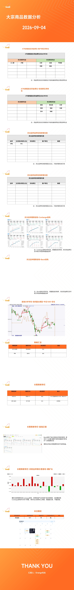
*盘后数据分析报告标准模板：包含ATR分析、IV全景、期限结构、策略总结、中长期策略建议等多个模块。*

**每周标准节奏**：

```
周末  → #每周深度复盘#（PDF附件，2+MB）
        → 详细持仓回顾、盈亏分析、策略胜率统计、下周展望

周日19:30  → #星球内部直播#
             → 单主题深度拆解 + 互动Q&A
```

**每日复盘标准模板**：

```
#今日复盘/明日计划# [日期]日复盘

文字版：[一句话总结核心观点]
视频版：[腾讯会议链接]

1. 股指：[观点+策略建议]
2. 有色板块：[观点+策略建议]
3. 生猪鸡蛋红枣：[观点+策略建议]
4. 能化板块：[观点+策略建议]
5. 广期所：[观点+策略建议]
6. 纯碱玻璃：[观点+策略建议]
7. 油脂油料天然橡胶：[观点+策略建议]
```


*"Orange今日说"品牌标识：权知道×权风险，Delta爆发点×Gamma爆发点。*

### 结果

- **严格执行工作流**：确保不遗漏任何重要信号，决策有据可查
- **标准化输出**：使团队成员和学员可以复用同一套分析框架
- **复盘积累**：每日/每周的复盘形成可追溯的交易记录，支持持续改进

## 5.3 交易复盘闭环

### 理论

复盘不是简单的"回顾今天做了什么"，而是一个**数据驱动的迭代改进系统**。Orange体系的复盘闭环遵循：交易记录 → 统计分析 → 模式识别 → 策略迭代。没有复盘的交易只是"经历"，有复盘的交易才是"经验"。

### 方法

#### 第一环：交易记录（每日）

每笔交易必须记录以下信息：

```
日期 / 品种 / 策略类型 / 方向
入场理由（对应五层信号中的哪几层支持）
入场价格 / IV水平 / Greeks暴露
仓位大小 / 止损位
出场价格 / 出场理由
盈亏（绝对值 + 占资金比例）
复盘反思（做对了什么 / 做错了什么 / 下次如何改进）
```

#### 第二环：统计分析（每月）

| 统计维度 | 指标 | 目的 |
|---------|------|------|
| 总体表现 | 月度盈亏、最大回撤、夏普比 | 评估整体健康度 |
| 按策略分类 | 双买胜率/盈亏比、双卖胜率/盈亏比、价差胜率/盈亏比 | 识别哪类策略最有效 |
| 按信号分类 | 高确认度交易胜率 vs 中确认度交易胜率 | 验证信号体系的有效性 |
| 按品种分类 | 各品种盈亏贡献 | 识别"舒适区"和"雷区" |
| 错误分析 | 止损次数/原因、违反纪律次数 | 识别需要改进的行为模式 |

#### 第三环：策略迭代（持续）

```
统计结果 → 调整策略权重
│
├── 高胜率策略 → 提高配置比例，优化入场条件
├── 低胜率策略 → 分析原因（环境问题？执行问题？）
│   ├── 环境问题 → 调整适用的波动率区间
│   └── 执行问题 → 修正入场/出场纪律
└── 持续亏损策略 → 暂停使用，重新评估逻辑
```

### 结果

- **完整闭环**：交易→记录→统计→迭代→更好的交易，形成正向循环
- **缺失闭环**：凭感觉交易，重复犯同样的错误，长期无法进步
- **核心结论**：复盘是将"交易经历"转化为"交易能力"的唯一途径

---

# 附录

## 附录A：知识基础设施

### A.1 内容标签体系

| 标签 | 频次 | 内容类型 |
|------|------|----------|
| #策略# | 483 | 具体交易策略建议 |
| #今日复盘/明日计划# | 374 | 每日收盘复盘 |
| #商品股指盘后数据分析# | 260 | 盘后数据图表 |
| #宏观基本面大事件解读# | 170 | 宏观/基本面深度分析 |
| #每周深度复盘# | 123 | 周末PDF深度复盘 |
| #星球内部直播# | 22 | 周日晚直播 |
| #中长期策略# | 6 | 长期持仓策略 |
| #Orange今日说# | 3 | 盘中要闻+风险提示 |

### A.2 核心作者与分工

| 作者 | 角色 | 内容特点 |
|------|------|----------|
| Orange期权创始*（Orange先生） | 创始人/首席策略师 | 策略发布、宏观分析、波动率背离体系 |
| Orange技术君 | 技术运营 | 每日复盘、盘后数据分析、标准化输出 |
| 风の天山 | 独立深度分析 | 每周深度复盘、多信号概率评估 |
| 莫大 | 波动率背离专家 | 波动率背离5分类体系 |
| Juno助教 | 教学 | 课程辅助 |
| 马队长 | 逆向情绪指标 | "第六感"反向信号 |

### A.3 工具生态

| 工具 | 用途 | 在体系中的位置 |
|------|------|-------------|
| OpenVLab | 策略构建与一键执行 | 策略→执行 |
| 波动率云图 | 全市场IV可视化 | 分析→波动率分析 |
| 盘后数据分析图 | 每日标准化数据输出 | 信号→数据输入 |
| 腾讯会议 | 每日视频复盘 | 工作流→复盘 |

**OpenVLab链接标准格式**：
```
【品种:日期 策略名 行权价】https://www.openvlab.cn/strategy/builder/xxxxx
```

### A.4 教学体系

**五阶学习路径**：

```
新手 → 双买课程（入门波动率概念）
  ↓
入门 → 双卖课程（理解卖方逻辑）
  ↓
进阶 → 末日轮课程（Gamma交易）
  ↓
高阶 → 波动率进阶训练营（背离/套利）
  ↓
工具 → OpenVLab合集教程（实操）
```

**五种教学方法**：

| 方法 | 形式 | 目的 |
|------|------|------|
| 实时案例教学 | 每笔交易都是教学素材 | 理论联系实际 |
| 评论纠正 | 直接指出学员理解错误 | 防止错误认知固化 |
| 模式识别训练 | 每日数据图作为视觉素材 | 培养"盘感" |
| 风控意识灌输 | 反复强调风险管理原则 | 建立风控本能 |
| 诚实复盘 | 公开承认错误交易 | 展示真实的交易过程 |

---

## 附录B：术语速查表

### B.1 波动率术语

| 术语 | 英文 | 含义 |
|------|------|------|
| 隐波/IV | Implied Volatility | 期权定价的核心变量，市场对未来波动的预期 |
| 实波/RV | Realized Volatility | 标的实际波动幅度 |
| 升波 | IV Rising | 隐波上升 |
| 降波 | IV Falling | 隐波下降 |
| 泄 | IV Collapse | 隐波快速坍塌 |
| 波动率背离 | Vol Divergence | 不同品种/月份IV走势分化 |
| 波动率云图 | Vol Surface | 波动率曲面可视化 |
| 偏度/Skew | Skew | 虚值认沽IV vs 虚值认购IV之差 |
| IV百分位 | IV Percentile | 隐波在历史中的排名位置 |
| 根号T原则 | √T Rule | 期权定价的时间归一化规则 |
| 期权墙 | Option Wall | 大量持仓集中的行权价 |

### B.2 策略术语

| 术语 | 英文 | 含义 |
|------|------|------|
| 双买 | Long Straddle | 同时买入认购+认沽（做多波动率） |
| 双卖 | Short Strangle | 同时卖出认购+认沽（做空波动率） |
| 宽跨式 | Strangle | 卖出虚值认购+虚值认沽 |
| 跨式 | Straddle | 卖出平值认购+平值认沽 |
| 末日轮 | End-of-Life Gamma | 即将到期期权，Gamma效应极大 |
| 彩票 | Lottery Ticket | 深虚值廉价期权，小概率高赔率 |
| 备兑 | Covered Call | 持有标的+卖出虚值认购 |
| 比例购 | Ratio Spread | 卖多买少的价差组合 |
| 牛三腿 | Bull Three-Leg | 多腿看涨策略组合 |
| 日历价差 | Calendar Spread | 买远月卖近月（同行权价） |
| 铁鹰 | Iron Condor | 四腿区间策略 |
| 海鸥 | Seagull | Risk Reversal组合 |

### B.3 市场结构术语

| 术语 | 英文 | 含义 |
|------|------|------|
| Back结构 | Backwardation | 近期价格 > 远期价格（现货溢价） |
| Contango | Contango | 远期价格 > 近期价格（期货溢价） |
| 基差 | Basis | 现货价格 - 期货价格 |
| 正套 | Bull Spread | 买近月卖远月 |
| 反套 | Bear Spread | 卖近月买远月 |
| 合成期货 | Synthetic Future | 用期权复制期货头寸 |

### B.4 基本面术语

| 术语 | 含义 |
|------|------|
| 库存+基差+利润 | 商品分析三要素框架 |
| 估值+驱动 | 判断品种是否值得交易的双条件 |
| TC/RC | 铜加工费（Treatment/Refining Charge） |
| 供需平衡表 | 供给vs需求量化对比 |
| 库存消费比 | 库存相对消费量的安全边际 |
| 负反馈 | 价格下跌→减产→供给收缩→价格企稳的循环 |

### B.5 Greeks与风控术语

| 术语 | 含义 |
|------|------|
| Delta | 标的价格变动1单位时期权价格变动量 |
| Gamma | Delta的变化速率，到期日前最大 |
| Vega | 隐波变动1%时期权价格变动量 |
| Theta | 每天时间价值衰减量 |
| Delta Cash | 考虑标的实际头寸后的净Delta暴露 |
| Delta配平 | Delta对冲至中性 |
| Vega配平 | Vega对冲至中性 |
| Gamma Scalping | 利用Gamma进行日内波段交易 |
